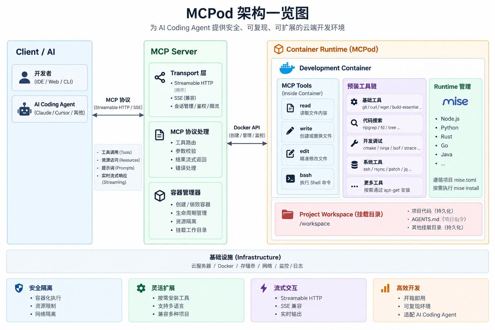

# MCPod

**MCP-controlled Development Container** — turns a full Linux development
environment into an MCP endpoint an AI agent can reliably operate.



MCPod does not wrap every development capability into an MCP tool. It exposes
four generic primitives and hands the rest to a full Linux environment:

| MCP Tool | Purpose |
|----------|---------|
| `read`   | Read file contents (paginated text / images) |
| `bash`   | Execute shell commands (compile, test, git, mise, package managers, ...) |
| `edit`   | Precise multi-edit text replacement with diffs |
| `write`  | Create or completely rewrite files |

The tool UX mirrors the Pi Coding Agent: read truncates from the head
(2000 lines / 50 KiB) with `offset` pagination; bash truncates from the tail
and saves full output to `/tmp/mcpod-bash-*.log`; edit's `edits[]` array
matches against the original file with all-or-nothing semantics; every write
goes through a per-file queue with atomic temp+rename commits.

Runtimes (node, python, rust, go, ...) are managed inside the container by
[mise](https://mise.jdx.dev) driven by the project's own `mise.toml`.

## Dual Transport

MCPod serves two remote MCP transports side by side:

| Transport | Endpoint | Status |
|-----------|----------|--------|
| **Streamable HTTP** (2026-07-28 / 2025-11-25) | `POST /mcp` | **Primary** |
| Legacy HTTP+SSE (2024-11-05) | `GET /sse` + `POST /messages` | Compatibility |

`/sse` is provided for backwards compatibility with legacy MCP clients that
only speak SSE; modern clients should always use `/mcp`.

```
AI Agent ── MCP ──> MCPod Server ──> Debian 13 container
                    · dual transport · mise, git, gcc, rg, ...
                    · Bearer auth     · /workspace
                    · 4 tools + environment resource
```

## Quick Start

### Option A: docker compose (build from source)

```bash
git clone <this-repo> && cd MCPod
export MCPOD_TOKEN="$(openssl rand -hex 32)"   # unset = no auth, see below
docker compose up -d                            # binds 127.0.0.1:3000 only

curl http://localhost:3000/health               # -> {"status":"ok"}
```

### Option B: docker pull / run (Docker Hub)

```bash
docker run -d --name mcpod \
  -p 127.0.0.1:3000:3000 \
  -e MCPOD_TOKEN="$(openssl rand -hex 32)" \
  -v "$PWD/workspace:/workspace" \
  fb0sh/mcpod:latest
```

Image: [hub.docker.com/r/fb0sh/mcpod](https://hub.docker.com/r/fb0sh/mcpod)
(tags: `latest`, `2.0.0`)

### Option C: run on the host (no Docker)

Download a prebuilt `mcpod` binary from
[GitHub Releases](https://github.com/fb0sh/MCPod/releases)
(`mcpod-linux-x64.tar.gz`, `mcpod-macos-arm64.tar.gz`, each with a `.sha256`
checksum) and run it directly:

```bash
tar -xzf mcpod-macos-arm64.tar.gz
MCPOD_TOKEN="$(openssl rand -hex 32)" ./mcpod   # run from your project dir
# -> mcpod server started addr=127.0.0.1:3000 workspace=/path/to/cwd
```

**The workspace defaults to the current directory** — no need to set
`MCPOD_WORKSPACE` (set it only to point somewhere else); `./mcpod --help`
lists every environment variable.

The Linux build is a fully static musl binary that runs on any x86_64 distro
(including Alpine and old-glibc systems); the macOS build is arm64. You can
also build from source: `cd mcp-server && cargo build --release`. It is the
same server that runs inside the container — agent client configuration is
identical.

Note: in host mode `read/write/edit/bash` operate directly on the host
filesystem and bash runs as your current user — there is no Docker isolation
boundary. Use it only in trusted environments, and always set `MCPOD_TOKEN`
(it binds to `127.0.0.1` only by default).

### Agent client configuration

Modern client (Streamable HTTP, recommended):

```json
{
  "mcpServers": {
    "mcpod": {
      "type": "http",
      "url": "http://localhost:3000/mcp",
      "headers": {
        "Authorization": "Bearer ${MCPOD_TOKEN}"
      }
    }
  }
}
```

Legacy SSE client (compatibility):

```text
URL:  http://localhost:3000/sse
Auth: Bearer ${MCPOD_TOKEN}
```

Both transports expose identical tools / resources / instructions (one
MCPod core, two transport adapters).

## Configuration

| Variable | Default | Description |
|----------|---------|-------------|
| `MCPOD_TOKEN` | *(unset)* | Bearer token. **Unset disables authentication** (a warning is logged at startup) |
| `MCPOD_PORT` | `3000` | HTTP listen port |
| `MCPOD_WORKSPACE` | current directory (`/workspace` in the image) | Workspace root; file tools are jailed here |
| `MCPOD_HOST` | `127.0.0.1` (`0.0.0.0` in the image) | Bind address |
| `MCPOD_ALLOWED_HOSTS` | *(unrestricted)* | Comma-separated `Host` header allowlist. Default: any Host is accepted (IP / domain / reverse proxy); set to restrict |
| `MCPOD_ALLOWED_ORIGINS` | *(localhost defaults)* | `Origin` allowlist; defaults allow localhost/127.0.0.1/[::1] on any port |
| `MCPOD_SSE_SESSION_TTL` | `30m` | How long a disconnected legacy SSE session lingers |
| `MCPOD_SSE_KEEPALIVE` | `15s` | SSE `: keepalive` heartbeat interval |

**Authentication**: when `MCPOD_TOKEN` is set, `POST /mcp`, `GET /sse`, and
`POST /messages` all require `Authorization: Bearer <token>` (401 otherwise);
`GET /health` is always public. When it is unset, authentication is disabled —
anyone who can reach the port controls the container, and the startup log
says so loudly.

## Container permissions

The container entrypoint (`scripts/docker-entrypoint.sh`) sets up the
identity model automatically — **zero configuration**:

```text
stat the owner UID/GID of $MCPOD_WORKSPACE (the bind-mounted project)
        ↓
remap the image's `mcpod` user/group onto that UID/GID (usermod/groupmod)
        ↓
prepare a writable /home/mcpod ($HOME: user-level mise state, .gitconfig, .ssh, ...)
        ↓
drop privileges with setpriv; the whole MCPod process tree runs as `mcpod`
```

Consequences:

- **Correct file ownership**: files created by `read`/`write`/`edit`/`bash`
  (including `edit`'s atomic rename) belong to the host workspace user. On
  native Linux bind mounts, no more `root:root` files.
- **No configuration needed**: no `PUID`/`PGID`/`UID`/`GID` variables, no
  `--user`, no `chown -R`. `docker compose up -d` or
  `docker run -v "$PWD/workspace:/workspace" ...` just works.
- **Agents get passwordless sudo**: inside the container the agent is the
  regular `mcpod` user, but can run `sudo apt-get install -y <pkg>` to
  install system software — usable immediately, no restart.
- **sudo ownership semantics**: an explicit `sudo touch /workspace/foo`
  creates a root-owned file — standard Linux behavior; don't prefix ordinary
  project commands with sudo.
- **Stable writable HOME**: `$HOME=/home/mcpod` holds git/ssh/pip/mise user
  state; the preinstalled mise runtimes (`/usr/local/share/mise`) are shared
  read-only while `mise install` puts new runtimes into `$HOME`.
- **UID/GID collision safe**: if the target UID/GID already exists in the
  image, `usermod/groupmod -o` handles it; `sudo`, `getpwuid()`, and git all
  keep working.

Two special cases:

- **Root-owned workspace** (e.g. Docker Desktop file sharing, root-owned
  volumes): MCPod keeps running as root (the historical behavior). On
  macOS/Windows Docker Desktop, host-side ownership is governed by the file
  sharing layer, so the UID mapping is mostly relevant for native Linux.
- **Custom `MCPOD_WORKSPACE`**: `docker run -e MCPOD_WORKSPACE=/project -v
  "$PWD:/project" ...` works the same way — the entrypoint reads the owner
  of `$MCPOD_WORKSPACE`.

### Security boundary

The MCP `bash` tool is arbitrary command execution by design; with
passwordless sudo, **control of the MCPod endpoint ≈ root control of the
container** (limited to the container itself and directories the user
explicitly mounted into it). Be sure to:

- set `MCPOD_TOKEN`, keep the default `127.0.0.1` port binding, and never
  expose an unauthenticated endpoint to untrusted networks;
- do not mount the Docker socket (`/var/run/docker.sock`), do not use
  `--privileged`, and only mount host directories the agent truly needs;
- for stricter isolation you can re-add `security_opt:
  ["no-new-privileges:true"]` yourself — at the cost of losing sudo.

## Tool semantics

- **read** — `{"path", "offset"?, "limit"?}`: 1-based line pagination, head
  truncation at 2000 lines / 50 KiB with a `Use offset=N to continue` note.
  Images (png/jpeg/gif/webp/bmp, detected by content) return as MCP image
  blocks, downscaled to ≤2000×2000.
- **bash** — `{"command", "timeout"?}`: `/bin/bash -c` in the workspace;
  there is **no default timeout**. stdout/stderr merge in arrival order;
  output is tail-truncated at 2000 lines / 50 KiB and the full log is saved
  to `/tmp/mcpod-bash-<id>.log`. Timeouts and cancelled requests kill the
  entire process tree (process groups). Non-zero exits keep the output and
  are marked as errors.
- **edit** — `{"path", "edits": [{"oldText", "newText"}]}`: every `oldText`
  is matched against the **original** file, must be unique, and edits must
  not overlap; the whole call is atomic. CRLF endings and UTF-8 BOMs are
  preserved; a limited Unicode normalization fallback (smart quotes, dashes,
  spaces) improves match robustness. Success returns `firstChangedLine`, a
  context `diff`, and a unified `patch`.
- **write** — `{"path", "content"}`: creates parent directories, replaces
  atomically. Concurrent writes/edits to the same file serialize through a
  per-file mutation queue.

All file tools accept relative or workspace-absolute paths and are jailed to
`MCPOD_WORKSPACE`: path traversal, sibling-prefix tricks (`/workspace-evil`),
and symlink escapes are rejected by canonicalization. `bash` is a
container-level capability — the agent runs as `mcpod` and can become
container root via sudo; the Docker boundary (no `privileged`, no Docker
socket, localhost-only port binding) is the security boundary. See
"Container permissions".

## Development

```bash
cd mcp-server
cargo test     # 127 tests: both transports, protocol, auth, tools, truncation, concurrency
cargo clippy
```

The server binary also runs outside Docker
(`MCPOD_TOKEN=dev MCPOD_WORKSPACE=/tmp/ws cargo run`); the integration tests
drive the real HTTP surface, including black-box tests with the official rmcp
client and 2024-11-05 SSE compatibility tests.

```bash
scripts/acceptance.sh   # container acceptance: both transports + tool matrix
```

## Layout

```
MCPod/
├── .github/workflows/      # CI: test gate + mcpod host binaries (linux-x64 / macos-arm64)
├── Dockerfile              # multi-stage: rust builder -> debian:13-slim (mcpod user + sudo)
├── docker-entrypoint.sh    # under scripts/: workspace-owner mapping + privilege drop
├── compose.yaml            # localhost-only binding
├── docs/structure.png      # architecture diagram
├── scripts/acceptance.sh   # container acceptance script (incl. ownership regression)
├── mcp-server/             # Rust MCP server (rmcp + axum + tokio)
│   └── src/
│       ├── transport/      # streamable_http (/mcp) + legacy_sse (/sse + /messages)
│       ├── tools/          # read, bash, edit, write
│       ├── fs/             # path sandbox, mutation queue, atomic writes, text
│       ├── output/         # head/tail truncation (2000 lines / 50 KiB)
│       └── process/        # process-group execution and tree kills
└── workspace/              # mounted into the container at /workspace
```

## License

MIT
